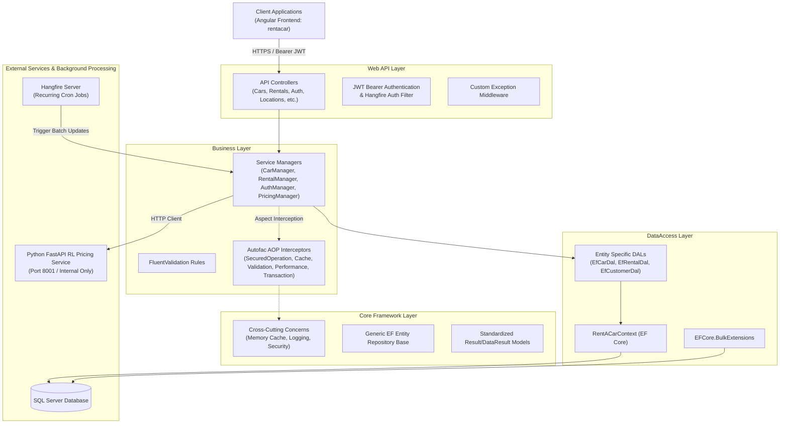
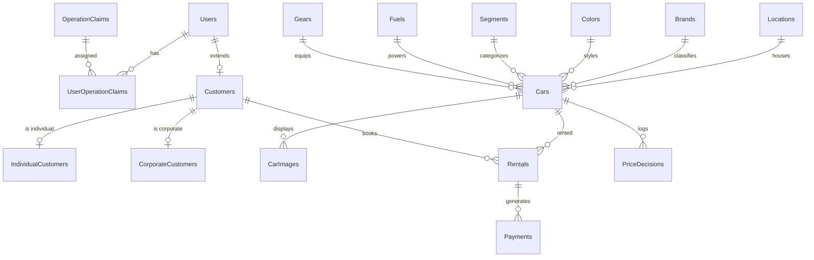

# CarProject — Car Rental Backend & Dynamic Pricing API

A multi-layered ASP.NET Core RESTful backend for an enterprise car rental management platform. It implements clean architecture separation (Core, Entities, DataAccess, Business, Web API) with Aspect-Oriented Programming (AOP) via Autofac and Castle DynamicProxy, JWT authentication with granular role/claim management, Entity Framework Core with SQL Server, Hangfire background task scheduling, and an integration layer with a reinforcement learning dynamic pricing engine.

This repository serves as the **core backend**. The companion Angular frontend is located in [rentacar](https://github.com/kamiltuncok/rentacar).

---

## Recruiter & Engineering Summary

- **Primary Stack**: .NET 7 / ASP.NET Core Web API, C#, Entity Framework Core, SQL Server, Autofac (AOP / DynamicProxy), FluentValidation, Hangfire, JWT.
- **Key Engineering Highlights**: Strict N-tier modular architecture, custom interceptor-based cross-cutting concerns (caching, transactions, validation, performance profiling, role security), asynchronous batch processing with EFCore.BulkExtensions, and periodic background price adjustment scheduling.
- **Primary Technical Challenge**: Decoupling cross-cutting infrastructure from domain business logic using dynamic proxy interception, and orchestrating batch price recomputations with an external reinforcement learning service without blocking database operations or exposing the ML service directly to clients.

---

## System Architecture

The solution follows a strict onion / layered architecture where each layer depends only on abstractions of inner or core layers:



### Layer Responsibilities

1. **`Core`**: Reusable framework layer completely independent of the business domain. Provides generic repository patterns (`IEntityRepository`, `EfEntityRepositoryBase`), standardized result wrappers (`IDataResult<T>`, `IResult`), security primitives (JWT helper, hashing, encryption), and Autofac dynamic proxy interceptors.
2. **`Entities`**: Domain models and Data Transfer Objects (DTOs). Contains concrete business entities (`Car`, `Rental`, `Brand`, `Color`, `Customer`, `IndividualCustomer`, `CorporateCustomer`, `Location`, `PriceDecision`, etc.) and aggregated DTOs (`CarDetailDto`, `RentalDetailDto`, `CustomerDetailDto`).
3. **`DataAccess`**: Concrete database mapping via Entity Framework Core (`RentACarContext`), entity configurations, and custom Linq/Join queries in specialized DAL classes.
4. **`Business`**: Domain rules, business logic validation (`FluentValidation`), business managers implementing interfaces, and Autofac dependency injection modules.
5. **`Web API`**: ASP.NET Core controllers exposing RESTful endpoints, JWT middleware, CORS policy, custom global exception handling middleware, and Hangfire dashboard configuration.
6. **`ConsoleUI`**: CLI test runner used for rapid local testing of service workflows.

---

## Technology Stack

| Category | Technologies |
|---|---|
| **Runtime & Framework** | .NET 7 / ASP.NET Core Web API, C# |
| **Data Access & ORM** | Entity Framework Core 7, EFCore.BulkExtensions, Microsoft SQL Server |
| **Dependency Injection & AOP** | Autofac 7, Autofac.Extras.DynamicProxy, Castle.Core (DynamicProxy) |
| **Validation** | FluentValidation |
| **Authentication & Security** | JWT (System.IdentityModel.Tokens.Jwt), HMAC-SHA512 Password Hashing & Salting |
| **Background Processing** | Hangfire (Memory Storage & Background Server) |
| **HTTP Client & Integration** | System.Net.Http, Newtonsoft.Json, System.Text.Json |

---

## Key Features & Technical Highlights

### 1. Aspect-Oriented Programming (AOP) with Autofac & DynamicProxy
Cross-cutting concerns are decoupled from business methods via method-level attributes intercepted at runtime:
- `[SecuredOperation("admin,car.add")]`: Enforces role/claim authorization via `IHttpContextAccessor` before method execution.
- `[ValidationAspect(typeof(CarValidator))]`: Intercepts method invocations and validates incoming entities against FluentValidation rules before execution.
- `[CacheAspect]`: Caches return values in memory using deterministic cache keys.
- `[CacheRemoveAspect("ICarService.Get")]`: Automatically evicts relevant cache entries upon data mutation (Add/Update/Delete).
- `[PerformanceAspect(interval: 5)]`: Measures execution time and triggers warnings if a method takes longer than the configured threshold.
- `[TransactionScopeAspect]`: Wraps transactional operations in an ambient `TransactionScope` with automatic rollback on unhandled exceptions.

### 2. Reinforcement Learning Dynamic Pricing Proxy & Bulk Batching
- Integrates with an external Python FastAPI Q-learning pricing service.
- Direct external access to the ML service is blocked; `PricingManager` acts as the secure reverse proxy and coordinator.
- **N+1 Prevention**: In `UpdateAllPricesAsync()`, active cars and historical rentals are fetched in single consolidated database queries, transformed into batch payloads, and sent to the ML endpoint.
- **Bulk Database Writes**: Price updates are persisted back to SQL Server using `EFCore.BulkExtensions` (`BulkUpdateAsync`) instead of issuing hundreds of individual SQL `UPDATE` statements.
- **Recurring Automation**: Integrated with Hangfire recurring jobs (`RecurringJob.AddOrUpdate`) to periodically execute automated fleet repricing cycles.

### 3. Granular Multi-Tenant & Role-Based Authorization
- Distinguishes between **Individual Customers**, **Corporate Customers**, **Location Managers**, and **System Administrators**.
- Operation claims are stored in relational database tables (`OperationClaims`, `UserOperationClaims`, `LocationOperationClaims`, `LocationUserRoles`) and injected as claims into signed JWT tokens.

### 4. Resilient Security & Configuration Hygiene
- Password credentials are stored using unique salt and HMAC-SHA512 hashing (`HashingHelper`).
- Sensitive connection strings and JWT signing keys are loaded through environment variables (`RENTACAR_CONNECTION_STRING`, `TokenOptions__SecurityKey`) and untracked `appsettings.Local.json` files, preventing secrets from being committed to source control.
- Global exception handling middleware (`ConfigureCustomExceptionMiddleware`) catches unhandled exceptions and returns RFC 7807-compliant standardized error responses without leaking stack traces.

---

## Project Structure

```
CarProject/
├── Business/                      # Business logic, Managers, Validation & Autofac Modules
│   ├── Abstract/                  # Service interfaces (ICarService, IRentalService, etc.)
│   ├── Concrete/                  # Service implementations (CarManager, PricingManager, etc.)
│   ├── BusinessAspects/Autofac/   # [SecuredOperation] claim authorization aspect
│   ├── Constants/                 # System messages and HTTP constants
│   ├── DependencyResolvers/       # AutofacBusinessModule configuration
│   └── ValidationRules/FluentValidation/ # FluentValidation validators
├── Core/                          # Universal enterprise framework
│   ├── Aspects/Autofac/           # Caching, Performance, Transaction, Validation aspects
│   ├── CrossCuttingConcerns/      # Caching, Logging, and Validation engines
│   ├── DataAccess/                # Generic IEntityRepository & EF implementation
│   ├── Entities/                  # IEntity, IDto, User, OperationClaim base models
│   ├── Extensions/                # ServiceCollection, Claims, Exception middleware extensions
│   └── Utilities/                 # Security (JWT, Hashing), Results pattern, IoC helpers
├── DataAccess/                    # Entity Framework Core DbContext, Migrations, DALs
│   ├── Abstract/                  # Specific DAL interfaces (ICarDal, IRentalDal, etc.)
│   ├── Concrete/EntityFramework/  # RentACarContext and Ef*Dal implementations
│   └── Migrations/                # EF Core schema migration history
├── Entities/                      # Domain entities and DTOs
│   ├── Concrete/                  # Car, Rental, Brand, Color, Location, PriceDecision, etc.
│   ├── DTOs/                      # Composite query DTOs (CarDetailDto, RentalDetailDto, etc.)
│   └── Enums/                     # CarStatus, PaymentStatus, etc.
├── Web API/                       # ASP.NET Core presentation layer
│   ├── Controllers/               # REST API Controllers (Cars, Rentals, Auth, etc.)
│   ├── Security/                  # HangfireDashboardAuthorizationFilter
│   ├── Program.cs & Startup.cs    # Pipeline, DI, JWT, CORS, and Hangfire initialization
│   └── appsettings.json           # Template configuration (secrets git-ignored)
└── ConsoleUI/                     # Console verification and smoke-test harness
```

---

## API Overview

All REST API endpoints are exposed under `/api/*`. Key route groups include:

| Controller | Base Route | Key Operations |
|---|---|---|
| **Auth** | `/api/auth` | User login (`/login`), register (`/register`), corporate register (`/registerforcorporate`) |
| **Cars** | `/api/cars` | Fleet CRUD, detail lookups (`/getcardetails`), branch filters (`/getbybranch`), brand/color filters |
| **Dynamic Pricing** | `/api/cars` | Single car recommendation (`/{id}/recommended-price`), single price update (`/{id}/update-price`), batch update (`/update-prices-batch`), performance metrics (`/pricing/performance`) |
| **Rentals** | `/api/rentals` | Rental creation (`/add`), return processing (`/return`), active rentals (`/getrentaldetails`) |
| **Locations & Branches** | `/api/locations` | Location CRUD, city-based branch listings |
| **Location Managers** | `/api/locationmanagers` | Branch manager management and permission assignment |
| **Reference Lookups** | `/api/brands`, `/api/colors`, `/api/fuels`, `/api/gears`, `/api/segments` | Master lookup data management |
| **Car Images** | `/api/carimages` | Car image uploads, deletion, and retrieval |
| **Users & Customers** | `/api/users`, `/api/customers`, `/api/individualcustomers`, `/api/corporatecustomers` | Customer profiling and claim management |

---

## Database & Entity Model

The relational schema is managed through Entity Framework Core Code-First migrations and includes:

- **Fleet Entities**: `Cars`, `Brands`, `Colors`, `Fuels`, `Gears`, `Segments`, `CarImages`.
- **Location & Organization**: `Locations`, `LocationCities`, `LocationManagers`, `LocationUserRoles`, `LocationOperationClaims`.
- **Customers & Users**: `Users`, `Customers`, `IndividualCustomers`, `CorporateCustomers`, `OperationClaims`, `UserOperationClaims`.
- **Transactions & Pricing**: `Rentals`, `Payments`, `PriceDecisions`.



---

## Getting Started

### Prerequisites

- [.NET 7 SDK](https://dotnet.microsoft.com/download/dotnet/7.0)
- [Microsoft SQL Server](https://www.microsoft.com/en-us/sql-server/) (local instance or Docker container)
- Optional: Python 3.10+ (if running the RL pricing companion microservice locally)

### 1. Configuration Setup

Create a `Web API/appsettings.Local.json` file (or set environment variables) to provide required database and cryptographic secrets:

```json
{
  "ConnectionStrings": {
    "RentACar": "Server=localhost,1433;Database=RentACar;User Id=sa;Password=YourSecurePassword123!;TrustServerCertificate=True;"
  },
  "TokenOptions": {
    "Audience": "www.rentacar.com",
    "Issuer": "www.rentacar.com",
    "AccessTokenExpiration": 60,
    "SecurityKey": "your-super-secret-jwt-key-with-minimum-256-bits-length"
  }
}
```

Alternatively, configure environment variables:
```powershell
$env:RENTACAR_CONNECTION_STRING = "Server=localhost,1433;Database=RentACar;User Id=sa;Password=YourSecurePassword123!;TrustServerCertificate=True;"
$env:TokenOptions__SecurityKey = "your-super-secret-jwt-key-with-minimum-256-bits-length"
```

### 2. Apply Migrations & Seed Database

```bash
dotnet ef database update --project DataAccess --startup-project "Web API"
```

### 3. Run the Backend Web API

```bash
dotnet run --project "Web API"
```

The API service starts on `https://localhost:44306` (or `http://localhost:5000`).
- **Hangfire Dashboard**: `https://localhost:44306/hangfire`

---

## Engineering Decisions & Trade-offs

1. **Autofac & Castle DynamicProxy over Standard ASP.NET Core Action Filters**:
   - *Rationale*: Action Filters only intercept HTTP requests at the controller boundary. Using Autofac dynamic proxy interceptors enables cross-cutting concerns (validation, caching, security checks) directly on service interface methods, making the business layer testable and reusable outside an HTTP context (e.g. CLI or background jobs).
2. **Bulk Extensions for Batch Price Updates**:
   - *Rationale*: When updating prices across hundreds of vehicles simultaneously from the RL engine, standard EF Core `SaveChanges` generates individual parameter queries. `EFCore.BulkExtensions` executes high-performance batch SQL statements, reducing database roundtrips.
3. **In-Memory Hangfire Storage vs Persistent Job Storage**:
   - *Current Decision*: Hangfire uses in-memory storage for development convenience and recurring job triggering.
   - *Limitation*: Job state does not persist across application restarts.

---

## Known Limitations & Roadmap

- **Unit & Integration Test Coverage**: The core architecture includes validation and business layers, but unit/integration tests with Moq/xUnit need to be expanded.
- **SQL Server Connection Pooling**: Requires production-grade database retry policies with EF Core execution strategies (`EnableRetryOnFailure`).
- **Distributed Caching**: The current caching aspect uses in-memory caching (`IMemoryCache`); transitioning to Redis will allow horizontal scaling.
