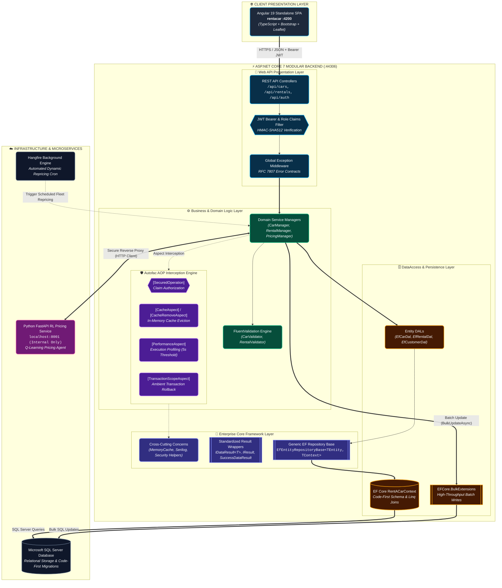
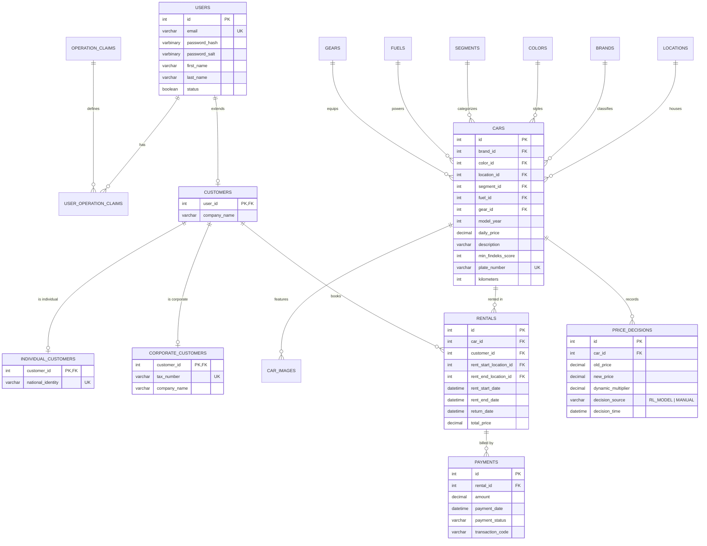

# CarProject — Car Rental Enterprise Backend & Dynamic Pricing API

<div align="center">


**A high-performance, N-tier ASP.NET Core REST API featuring Aspect-Oriented Programming (AOP), dynamic reinforcement learning price adjustment proxying, and multi-tenant claim authorization.**

[Live API Endpoints](#api-overview--route-matrix) • [Architecture Guide](#system-architecture) • [Quick Setup](#getting-started--local-setup) • [Frontend Client](https://github.com/kamiltuncok/rentacar)

</div>

---

> ### 📋 GitHub Repository Metadata
> * **Description:** Enterprise ASP.NET Core 7 car rental backend featuring Autofac AOP interceptors, EF Core, Hangfire batch scheduling, and RL dynamic pricing proxy.
> * **Topics:** `aspnetcore`, `csharp`, `dotnet-7`, `entity-framework-core`, `autofac-aop`, `clean-architecture`, `hangfire`, `dynamic-pricing`, `jwt`, `sql-server`

---

## 📖 Executive Summary & Core Value

CarProject is a multi-layered enterprise backend providing comprehensive vehicle fleet management, location administration, and transactional rental operations. The platform is designed around two key operational pillars:
1. **Fleet & Rental Operations:** Branch and vehicle inventory CRUD, multi-attribute filtering (Brand, Color, Segment, Fuel, Gear, Branch), reservation processing, customer claim verification, and Findeks score checks.
2. **Algorithmic Dynamic Pricing:** Coordinates batch pricing adjustments powered by an internal Python FastAPI Q-learning reinforcement learning microservice. Automated recurring repricing cycles are orchestrated via **Hangfire** and written in high-throughput batches using **EFCore.BulkExtensions**.

The architecture adheres to strict **Onion / Clean Architecture** principles, utilizing **Autofac** and **Castle DynamicProxy** to decouple cross-cutting concerns (caching, logging, validation, security, and transactions) from domain managers.

---

## 🎯 Evaluator Guide: Key Architectural Highlights

If you are an evaluator or technical recruiter reviewing code quality, here are the best starting points:

| Evaluated Concept | Key Implementation Files | Key Takeaway |
|---|---|---|
| **Aspect-Oriented Programming (AOP)** | `Core/Aspects/Autofac/` & `Business/BusinessAspects/` | Declarative method-level attributes (`[SecuredOperation]`, `[ValidationAspect]`, `[CacheAspect]`, `[PerformanceAspect]`, `[TransactionScopeAspect]`). |
| **RL Dynamic Pricing Reverse Proxy** | [`PricingManager.cs`](file:///c:/Users/MONSTER/OneDrive/Belgeler/GitHub/CarProject/Business/Concrete/PricingManager.cs) | Acts as a secure intermediary for an internal ML microservice; aggregates fleet metrics, sends batch requests, and updates SQL Server via `EFCore.BulkExtensions`. |
| **Generic EF Repository Base** | `Core/DataAccess/EntityFramework/EfEntityRepositoryBase.cs` | Universal, strongly-typed CRUD repository base with LINQ expression filtering and include joins. |
| **Unified Result Contracts** | `Core/Utilities/Results/` | Polymorphic `IDataResult<T>`, `IResult`, `SuccessDataResult<T>`, and `ErrorDataResult<T>` envelopes. |
| **Background Job Scheduling** | [`Startup.cs`](file:///c:/Users/MONSTER/OneDrive/Belgeler/GitHub/CarProject/Web%20API/Startup.cs) & `PricingManager` | Hangfire recurring jobs (`RecurringJob.AddOrUpdate`) executing automated fleet repricing without blocking user requests. |

---

## 🏛️ System Architecture



---

## 🗂️ Project Structure & Layer Responsibilities

```
CarProject/
├── Business/                      # Business & Domain Logic Layer
│   ├── Abstract/                  # Service interfaces (ICarService, IRentalService, IPricingService)
│   ├── Concrete/                  # Domain managers implementing business logic
│   ├── BusinessAspects/Autofac/   # [SecuredOperation] claim authorization aspect
│   ├── Constants/                 # Domain response and validation message constants
│   ├── DependencyResolvers/       # AutofacBusinessModule dependency registration
│   └── ValidationRules/FluentValidation/ # FluentValidation entity validators
├── Core/                          # Universal Cross-Cutting Framework (Domain-Agnostic)
│   ├── Aspects/Autofac/           # Caching, Performance, Transaction, Validation interceptors
│   ├── CrossCuttingConcerns/      # Caching engines, Logging, and Validation tooling
│   ├── DataAccess/                # Generic IEntityRepository & EF implementation base
│   ├── Entities/                  # IEntity, IDto, User, OperationClaim base primitives
│   ├── Extensions/                # ServiceCollection, Claims, Exception middleware extensions
│   └── Utilities/                 # Security (JWT, Hashing, Salting), Results pattern, IoC helpers
├── DataAccess/                    # Persistence & ORM Layer
│   ├── Abstract/                  # Entity DAL interfaces (ICarDal, IRentalDal, ICustomerDal)
│   ├── Concrete/EntityFramework/  # RentACarContext and specialized EF Linq DALs
│   └── Migrations/                # EF Core Code-First migration snapshots
├── Entities/                      # Domain Entities & Data Transfer Objects
│   ├── Concrete/                  # Car, Rental, Brand, Color, Location, PriceDecision, etc.
│   ├── DTOs/                      # Composite DTOs (CarDetailDto, RentalDetailDto, CustomerDetailDto)
│   └── Enums/                     # CarStatus, PaymentStatus, FuelType, GearType
├── Web API/                       # Presentation & Hosting Layer
│   ├── Controllers/               # REST API Controllers exposing endpoints
│   ├── Security/                  # HangfireDashboardAuthorizationFilter
│   ├── Program.cs & Startup.cs    # Pipeline, DI, JWT, CORS, and Hangfire initialization
│   └── appsettings.json           # Configuration template (secrets git-ignored)
└── ConsoleUI/                     # CLI verification harness for rapid local smoke testing
```

---

## 🗄️ Relational Database & Entity Model



---

## ⚡ Key Features & Engineering Highlights

### 1. Aspect-Oriented Programming (AOP) with DynamicProxy
Cross-cutting infrastructure concerns are intercepted transparently at runtime:
* `[SecuredOperation("admin,car.add")]`: Role/claim authorization enforced before method execution.
* `[ValidationAspect(typeof(CarValidator))]`: Intercepts arguments and applies FluentValidation rules.
* `[CacheAspect]`: Caches return values in memory using deterministic signature keys.
* `[CacheRemoveAspect("ICarService.Get")]`: Evicts matching cache patterns on data mutation.
* `[PerformanceAspect(interval: 5)]`: Emits warning logs if method execution exceeds threshold.
* `[TransactionScopeAspect]`: Wraps execution in an ambient `TransactionScope` with automatic rollback.

### 2. RL Dynamic Pricing Engine & Batch Processing
* **Secure Reverse Proxy:** The external Python FastAPI RL model is not exposed to the public internet; `PricingManager` authenticates and proxies all pricing requests.
* **Bulk Database Writes:** Batch updates are committed via `EFCore.BulkExtensions` (`BulkUpdateAsync`), reducing hundreds of database round-trips to a single query.
* **Automated Recurring Tasks:** Configured with **Hangfire** to execute periodic fleet-wide price optimizations.

---

## 🛠️ Technology Stack

| Domain | Technology |
|---|---|
| **Runtime & Framework** | .NET 7 / ASP.NET Core Web API, C# 11 |
| **Data Access & ORM** | Entity Framework Core 7, EFCore.BulkExtensions, Microsoft SQL Server |
| **DI & AOP Engine** | Autofac 7, Autofac.Extras.DynamicProxy, Castle.Core |
| **Validation** | FluentValidation 11 |
| **Security & Auth** | JWT (System.IdentityModel.Tokens.Jwt), HMAC-SHA512 Hashing & Salting |
| **Background Processing** | Hangfire (Memory Storage & Background Server) |
| **Integration** | HttpClient, System.Text.Json, Newtonsoft.Json |

---

## 🚀 Getting Started & Local Setup

### Prerequisites
* **.NET 7 SDK:** Version 7.0+
* **Microsoft SQL Server:** 2019+ (LocalDB, SQL Express, or Docker)
* **Optional (Python RL Service):** Python 3.10+ if running the dynamic pricing microservice locally.

### 1. Database Configuration
Create a `Web API/appsettings.Local.json` file in the project (or set environment variables):
```json
{
  "ConnectionStrings": {
    "RentACarContext": "Server=localhost;Database=RentACarDB;Trusted_Connection=True;TrustServerCertificate=True;"
  },
  "TokenOptions": {
    "Audience": "rentacar@rentacar.com",
    "Issuer": "rentacar@rentacar.com",
    "AccessTokenExpiration": 60,
    "SecurityKey": "YourSuperSecret256BitKeyForJwtSigningMustBeLongEnough"
  }
}
```

### 2. Apply EF Core Migrations
```bash
cd "Web API"
dotnet ef database update --project ../DataAccess
```

### 3. Run the Backend API
```bash
dotnet run --project "Web API"
```
The API server will initialize on **`https://localhost:44306`** and **`http://localhost:5000`**.

---

## 📡 API Overview & Route Matrix

| Controller | Route | Description |
|---|---|---|
| **Auth** | `/api/auth/login`, `/api/auth/register` | Authentication, JWT issuance, and claim assignment |
| **Cars** | `/api/cars/getcardetails` | Fleet catalogue with Brand, Color, Fuel, Gear, and Branch joins |
| **Dynamic Pricing** | `/api/cars/{id}/recommended-price` | Single-car ML recommendation |
| **Batch Pricing** | `/api/cars/update-prices-batch` | Fleet-wide bulk repricing execution |
| **Pricing Analytics** | `/api/cars/pricing/performance` | RL model vs control group utilization and revenue |
| **Rentals** | `/api/rentals/add`, `/api/rentals/return` | Booking validation, date conflicts, return processing |
| **Locations** | `/api/locations/getall` | Geographic branches and coordinates for Leaflet maps |
| **Reference Data** | `/api/brands`, `/api/colors`, `/api/fuels` | Vehicle master lookup data |

---

## 🔒 Security Best Practices & Configuration Hygiene

* **Cryptographic Salting:** User passwords are stored as `password_hash` and unique `password_salt` via HMAC-SHA512.
* **Secret Isolation:** Database connection strings and JWT keys reside in untracked `appsettings.Local.json` or environment variables (`RENTACAR_CONNECTION_STRING`).
* **RFC 7807 Standard Error Responses:** Global exception middleware intercepts all unhandled errors, ensuring no stack traces or database errors leak to clients.
